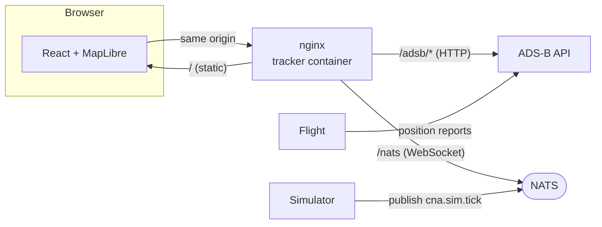

# Cloud Native Airlines Flight Tracker — Design & Plan

Companion to [FLIGHT_TRACKER_PROJECT_GOALS.md](FLIGHT_TRACKER_PROJECT_GOALS.md).
Records the design decisions for the first version and the plan to build it.

## Phase 1 scope

A **full-screen map**, a **clock driven by the Simulator**, and a **moving
aircraft icon** following the in-progress flight. The origin and destination
airports are shown. The details panel, flight trail, and rich freshness/empty/
error states from the goals doc are **phase 2** — this phase is the live picture:
open the page, and as the Simulator runs you watch the plane fly MSP→ORD with the
simulated clock ticking.

## Decisions at a glance

| Topic | Decision | Rationale |
| --- | --- | --- |
| Stack | **TypeScript + React + MapLibre GL JS**, built with Vite | Per the goals; MapLibre is open and key-optional. |
| Clock + run source | **Subscribe to NATS `cna.sim.tick` over WebSocket** (`nats.ws`) | Live push of `simulated_at` + `run_id`, genuinely "driven by the Simulator"; the tracker becomes another NATS consumer. |
| Positions | **Poll ADS-B over HTTP**, triggered by each tick | Ticks carry time/run, not position; goals doc says poll for positions. Fetching on each tick refreshes the map in lockstep with the clock. |
| Serving / CORS | **nginx in the tracker serves the SPA and reverse-proxies** `/adsb` → ADS-B and `/nats` → NATS (WebSocket) | One origin in the browser; no CORS changes to ADS-B, the Simulator, or NATS. |
| Runtime config | **`/config.json` fetched at startup** | One image configurable per environment (endpoints, aircraft id, airports, map style) without a rebuild. |
| Telemetry | **None** | Consistent with the rest of the stack — a future auto-instrumentation target, not hand-wired now. |

## Architecture



The browser talks only to the tracker's nginx. `nats.ws` subscribes to
`cna.sim.tick` through the `/nats` WebSocket proxy; position queries go through
the `/adsb` HTTP proxy.

## Data sources and contracts

**Tick** (NATS subject `cna.sim.tick`, consumed via `nats.ws`):

```json
{"run_id":"sim-…","tick_id":42,"simulated_at":"2026-10-06T14:30:00Z","paused":false,"speed":60.0,"tick_interval_s":1.0}
```

Drives the on-screen clock (`simulated_at`) and selects the active run
(`run_id`). A change in `run_id` means the Simulator was reset.

**Position** (ADS-B, through the proxy):

- `GET /adsb/api/v1/reports/latest?run_id=<run>&aircraft_id=<id>` → latest
  `{report:{…}}` for the marker. `404` before the first report (show "waiting
  for data", not an error).
- `GET /adsb/api/v1/reports?run_id=<run>&aircraft_id=<id>` → chronological history
  for the trail (**phase 2**).

Report fields are metres / metres-per-second / degrees `[0,360)`; the marker
rotates to `heading_deg`. The UI may convert to feet/knots for display with clear
labels (phase 2 readout); phase 1 keeps the marker and clock primary.

## The view (phase 1)

- **Map:** full-screen MapLibre, style URL from config (default: MapLibre demo
  tiles — no API key). Required attribution retained. If the style fails to load,
  show a clear message rather than a blank page.
- **Airports:** MSP and ORD markers from config (code shown; name on hover).
- **Aircraft:** a single marker at the latest reported `(latitude, longitude)`,
  an SVG plane rotated to `heading_deg`. On each tick, fetch latest and move it.
- **Clock HUD:** a corner overlay showing the simulated time from the tick stream,
  plus the run id and a paused indicator. A small "connecting…"/"disconnected"
  state reflects the NATS WebSocket connection.

## Run isolation and polling discipline

- Each tick carries `run_id`; when it changes, **clear** the marker and any cached
  position so two runs never mix.
- ADS-B fetches are **non-overlapping** (skip a fetch if one is in flight) and
  **run-stamped**: a response whose `run_id` is no longer current is discarded.
- Keep the last good position visible during a transient ADS-B error (phase 2 adds
  the explicit freshness/age labelling the goals doc describes).

## Configuration (`/config.json`)

Fetched once at startup so one image serves any environment:

```json
{
  "adsbBase": "/adsb",
  "natsUrl": "/nats",
  "tickSubject": "cna.sim.tick",
  "aircraftId": "N100CA",
  "mapStyle": "https://demotiles.maplibre.org/style.json",
  "airports": [
    {"code": "MSP", "name": "Minneapolis–Saint Paul", "lat": 44.8848, "lon": -93.2223},
    {"code": "ORD", "name": "Chicago O'Hare", "lat": 41.9742, "lon": -87.9073}
  ]
}
```

nginx serves a default `config.json`; a deployment can mount its own.

## Infrastructure changes (in `cloud-native-airlines`)

- **NATS:** enable the WebSocket listener (a small `websocket { port: 8080,
  no_tls: true }` config block; mount a `nats.conf`).
- **Compose:** add a `flight-tracker` service (built from `../flight-tracker`),
  publish its web port, and depend on `nats` and `adsb`. The nginx config proxies
  `/adsb` → `adsb:8080` and `/nats` → `nats:8080` (WebSocket upgrade headers).

## Build plan

### Phase 1 — map + clock + moving aircraft

1. **Scaffold** — Vite + React + TypeScript, MapLibre, runtime `config.json`
   loader, Dockerfile (node build → nginx), nginx proxy config, Makefile, CI.
2. **Map** — full-screen MapLibre with the configured style, airport markers, and
   a map-load error state.
3. **Clock via NATS** — `nats.ws` subscription to `cna.sim.tick`; render the
   simulated clock, run id, and connection state; handle run changes.
4. **Aircraft** — on each tick, fetch ADS-B latest (non-overlapping, run-stamped),
   place/move the marker, rotate to heading.
5. **Tests** — run isolation (run change clears state), superseded/own-run
   response handling, and the tick→fetch trigger.

**Phase 1 done when:** against the running stack, opening the tracker shows the
map with MSP/ORD; pressing play in the Simulator advances the on-screen clock and
flies the aircraft marker MSP→ORD from real ADS-B reports; a Simulator reset
clears and restarts cleanly.

### Phase 2 — details, trail, freshness, states

Selection + details panel (explicit units, separate simulated/real timestamps),
the reported trail from ADS-B history, the fresh/stale freshness indicator,
and the full loading/empty/stale/map-error/API-error states from the goals doc.

## Open items

- Confirm the NATS WebSocket path proxies cleanly through nginx (upgrade headers;
  `nats.ws` connecting to `ws(s)://<origin>/nats`).
- Map tiles: the MapLibre demo style is fine for the demo; decide a longer-term
  tile source and attribution.
- Units: whether phase 2 displays feet/knots or keeps the API's metres/mps.
